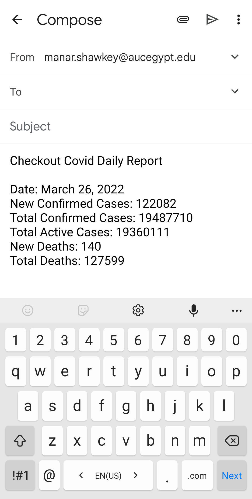

# Covid Daily Report

This is a demo Android app. The app provides recent information
about the number of Covid-19 confirmed cases and mortalities
during the past 10 days, in a country of the users’ choice.
The application also sends a daily reminder for the users
to keep their face-mask on if they're in a crowded place.

## Use Cases
1. View Covid-19 records of the past 10 days on the main Activity
2. Press a record to show more info in a new activity
3. Share the info over other apps
4. Choose one out of three countries to get its Covid data
5. Enable and disable the notifications

   
   
   

## Notes
1. This app is for educational purposes only.
2. All data used in this app is from [this API](https://about-corona.net/documentation)
3. The info about Covid-19 data in Egypt might
   be a little bit misleading, since the
   number of daily confirmed cases
   and daily mortalities are 0 in most of
   the records. This is not a bug, the ministry
   of health announces the data on a weekly  not
   daily basis since March 12nd.
   [Check out this news link.](https://www.youm7.com/story/2022/3/12/%D8%A8%D8%AF%D9%84%D8%A7-%D9%85%D9%86-%D8%A8%D9%8A%D8%A7%D9%86-%D9%8A%D9%88%D9%85%D9%89-%D8%A7%D9%84%D8%B5%D8%AD%D8%A9-%D8%AA%D8%B9%D9%84%D9%86-%D8%A5%D8%AD%D8%B5%D8%A7%D8%A6%D9%8A%D8%A7%D8%AA-%D8%A5%D8%B5%D8%A7%D8%A8%D8%A7%D8%AA-%D9%88%D9%88%D9%81%D9%8A%D8%A7%D8%AA-%D9%83%D9%88%D8%B1%D9%88%D9%86%D8%A7/5688630)

4. All icons used in this app are available for free use
   at: [iconfinder](https://www.iconfinder.com/)

